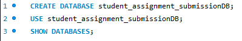
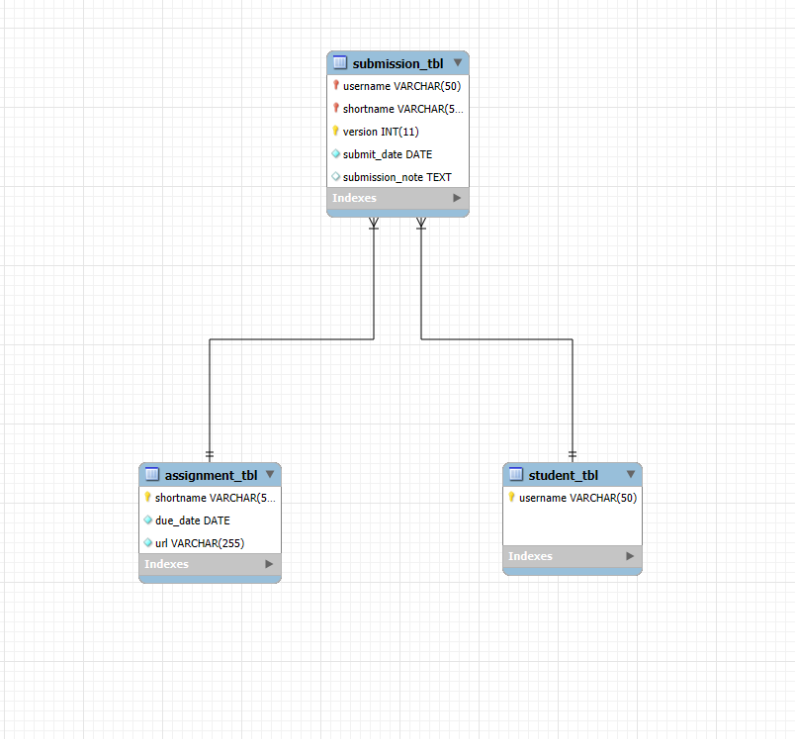

# Transform ER Model to Relational Tables

## Step 1: Create the Database and Use it

## Step 2: Create the student table

- username: String (VARCHAR), up to 50 characters.
  

## Step 3: Create the assignment table

- shortname: String (VARCHAR), up to 50 characters.
- due_date: DATE, cannot be null.
- url: String (VARCHAR), up to 255 characters, can be null.
  

## Step 4: Create the submission table

- username:String (VARCHAR), up to 50 characters.
- shortname: String (VARCHAR), up to 50 characters.
- version: Integer, represent the version of the submission.
- submit_date: DATE, cannot be null.
- data: Text.
- Note: Create the appropriate table relationship and enforce necessary REFERENTIAL INTEGRITY CONSTRAINTS.
  
 

**Copy of ER Diagram**

  

  

